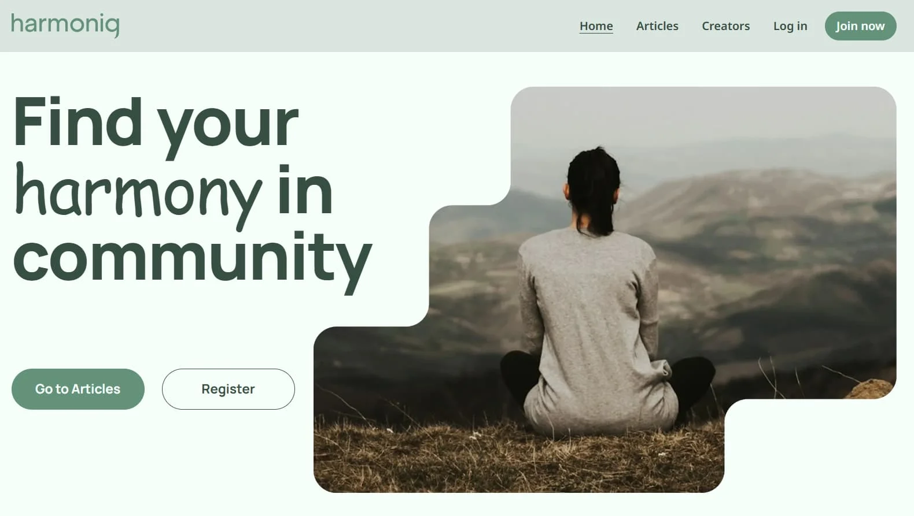

# 🧘 Harmoniq - Your Space. Your People. Your Harmony.

<p align="center">
  
</p>

---

## 🎯 About the Project

📄 **Live Page:** [View the project](https://frontend-project-final-7.vercel.app/)

**Harmoniq** is a modern multi-page full-stack web application designed for people who want to discover interesting articles, connect with new authors, and share their own content.

The platform combines content publishing with social interaction. Users can browse and discover articles, explore author profiles, save posts to bookmarks, create and edit their own articles, and manage their personal profiles.

The application is built with Next.js 15, React, TypeScript, and a REST API. It includes public and private routes, session-based authentication, server-side data management, and a responsive interface optimized for mobile, tablet, and desktop devices.

---

## 🚀 Features

- **🔐 Authentication:** user registration, login, automatic authentication, and logout.
- **📝 Articles:** article browsing, filtering, pagination, and recommendations.
- **✍️ Article Creation & Editing:** create, edit, and publish articles with images.
- **🔖 Bookmarks:** save and remove articles from the user's bookmarks.
- **👥 Authors:** browse the list of authors and view individual author profiles with their articles.
- **👤 User Profile:** access the authenticated user's own and saved articles.
- **📷 File Uploads:** upload profile avatars and article images.
- **🔔 Notifications:** toast notifications for errors and successful operations.
- **⏳ Loading States:** visual feedback during asynchronous operations.
- **📱 Responsive UI:** adaptive interface for mobile, tablet, and desktop devices.

---

## 🛠 Tech Stack

[](https://skillicons.dev)

| Component             | Technology / Library       |
| :-------------------- | :---------------------------- |
| **Frontend**          | Next.js 15, React, TypeScript |
| **Routing**           | Next.js App Router            |
| **Styling**           | CSS Modules, modern-normalize |
| **Forms**             | Formik, Yup                   |
| **Rich Text Editor**  | Tiptap                        |
| **Server State**      | TanStack Query                |
| **State Management**  | Zustand                       |
| **HTTP**              | Axios, REST API               |
| **Backend**           | Node.js, Express.js           |
| **Database**          | MongoDB, Mongoose             |
| **Authentication**    | Sessions, Cookies, bcrypt     |
| **Validation**        | Joi, Celebrate                |
| **File Upload**       | Multer                        |
| **API Documentation** | Swagger / OpenAPI             |
| **Code Quality**      | Prettier                      |
| **Deployment**        | Vercel / Render               |

---

## 🔙 Backend

The [Backend](https://github.com/SerdiukSerhii/project-backend-final-7) is implemented as a RESTful API using Node.js and Express.js.

**Core functionality includes:**

- user registration and authentication;
- session-based authentication;
- cookie and session management;
- CRUD operations for articles;
- author and profile management;
- saving articles to bookmarks;
- pagination and filtering;
- image uploads;
- data validation with Joi;
- centralized HTTP error handling;
- API documentation with [Swagger / OpenAPI ](https://fs-125-7-back.onrender.com/api-docs).

The application uses MongoDB for data storage, with Mongoose providing the data modeling and database interaction layer.

---

## 📐 Responsiveness & Optimization

The application follows a Mobile First approach:

**📱 Mobile:** from 320px, with responsive adaptation starting at 375px.

**📟 Tablet:** from 768px.

**💻 Desktop:** from 1440px.

Performance and user experience are improved through the use of Server Components, next/image, TanStack Query for server-state caching, and prefetching for dynamic lists.

---

## 👥 Our Team

|                                  Avatar                                  | Team Member                                           | Role                    |
| :----------------------------------------------------------------------: | :---------------------------------------------------- | :---------------------- |
|   | [Serhii Serdiuk](https://github.com/SerdiukSerhii)     | **Team Lead Fullstack** |
|  | [Olha Borzhynska](https://github.com/OlhaBorzhynska) | **Scrum Master**        |
|      | [Yuliia Kozak](https://github.com/YuliaKozak)           | Fullstack Developer     |
|     | [Alina Luzhniak](https://github.com/Alinavinnik)        | Fullstack Developer     |
|      | [Alina Rozental](https://github.com/alrozental)      | Fullstack Developer     |
|          | [Alina Melnyk](https://github.com/amlnkk)            | Fullstack Developer     |
|       | [Karyna Lubenska](https://github.com/Karina-Ll)      | Fullstack Developer     |
|       | [Maryna Vinnikova](https://github.com/Mary1-com)      | Fullstack Developer     |
|   | [Orest Stetsyk](https://github.com/Orest-Stetsyk)      | Fullstack Developer     |
|     | [Svitlana Gimish](https://github.com/svetlanagim)      | Fullstack Developer     |
|    | [Olena Vakula](https://github.com/vakulahelena)       | Fullstack Developer     |
|   | [Yuliia Karnaukh](https://github.com/Yuliia-sketch)      | Fullstack Developer     |
|    | [Yurii Olesich](https://github.com/YuriiOlesich)        | Fullstack Developer     |
|          | [Nataliia Korostelova](https://github.com/WKGHSN)     | **Team Lead QA**        |
|       | [Uliana Hvozd](https://github.com/Uliana-87)           | QA                      |

---

## ⚙️ Getting Started

**Clone the repository:**

```bash
git clone https://github.com/SerdiukSerhii/frontend_project_final_7.git
```

**Install dependencies:**

```bash
npm install
```

**Run the development server:**

```bash
npm run dev
```

## ✨ Harmoniq — Find your harmony in community ✨
